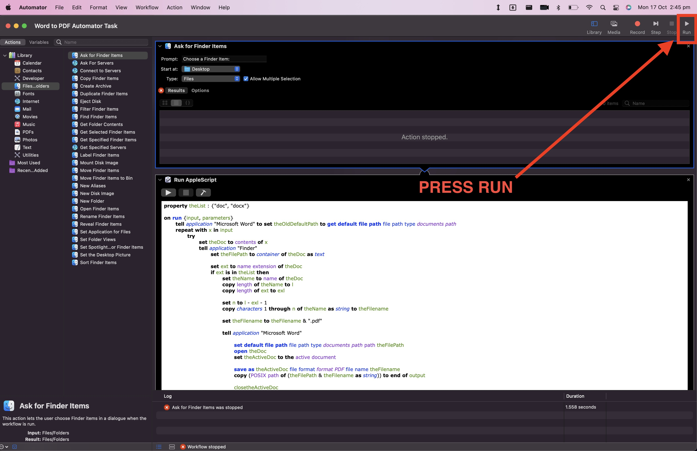

# Converting Microsoft Word documents to PDF

Open the file `Word to PDF Automator Task`. This will open in an application called 'Automator'.
Click on the 'Run' button on the top right. (See screenshot below).

You will be asked to select all documents you want to convert. Be sure they are `.doc` or `.docx` documents.

The output PDFs will be placed inside the same folder as the Word files.

> ⚠️ There is a possibility that some documents will simply not work.
> I recommend performing this task in batches, verifying each batch, and then manually converting the ones that fail.

## NOTE: Before running the task

Be sure that Microsoft Word is open, and that **all documents are closed**.
If you run the script and see Microsoft Word jumping on the dock, open it, and click 'Yes' on any popups.

