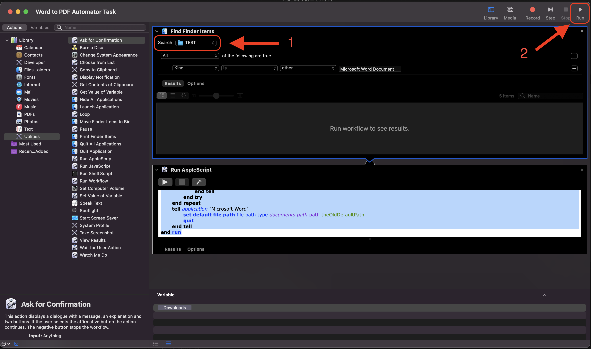

# Converting Microsoft Word documents to PDF

Open the file `Word to PDF Automator Task`. This will open in an application called 'Automator'. These steps correlate to the image below.

1. Change  the search folder to the location of all the Word documents:
2. Run the script

The output PDFs will be placed inside the same folder as the Word files.

## NOTE: Before running the task
Be sure that Microsoft Word is open, and that **all documents are closed**.
If you run the script and see Microsoft Word jumping on the dock, open it, and click 'Yes' on any popups.

